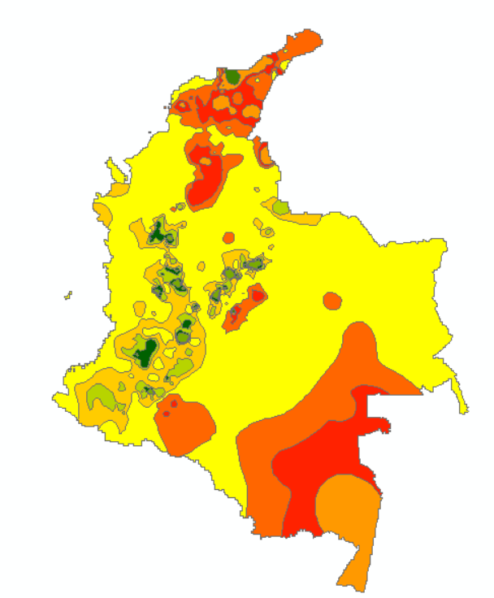

# Tarea 1 - Publicación de mapas web básicos

## Objetivos

• Utilizar datos geográficos para resolver un problema específico y publicar los resultados en la web para fácil acceso a los usuarios.
• Publicar mapas temáticos en la web

## Actividades 

• En el repositorio github personal creado para la clase crear una carpeta llamada Tarea_1
• Dentro de la carpeta Tarea_1 Crear un archivo Readme.md con la siguiente información: 
       * Cada item tiene un valor de 1 punto si está completo y correcto.
       * En caso de estar incompleto o incorrecto se otorgará 0 puntos.

## Items

**1. Cuál es el problema a tratar? ** 

Colombia es un país con una alta vulnerabilidad al cambio climático, por sus características físicas, geográficas, económicas, sociales y de biodiversidad, lo que implica que para el país, es de vital importancia generar la capacidad de entender las consecuencias que denotan los cambios en el clima, evaluando las amenazas sobre las comunidades vulnerables, previniendo los impactos sobre los territorios, ecosistemas y economías, moderando los daños potenciales, tomando ventaja de las oportunidades y enfrentando las consecuencias de un fenómeno como el cambio climático y sus impactos para el país (Minambiente, 2017). 

El clima tiene efectos en las actividades económicas de la población, especialmente aquellas que dependen directamente de la disponibilidad y calidad del agua, del suelo y de la biodiversidad. De igual forma, las manifestaciones del clima, y particularmente de cambio climático, pueden tener impactos en la salud e integridad de la población. 

Las lluvias intensas, así como la ausencia absoluta de ellas, afectan a cantidades incalculables de personas: desafían a las economías, interrumpen la cadena de producción de alimentos, crean incertidumbre y generan migraciones. De esta manera, los factores que propician niveles excepcionales de inundaciones o sequías en ciertas zonas del mundo.La información relacionada con el cambio climático es de vital importancia para la toma de decisiones. 

**2. Por qué los datos geográficos ayudan a resolverlo? **  

Los datos geográficos ayudan a resolverlo debido que permite tener soporte cartográfico para los análisis territoriales e información a nivel departamental y nacional. Así mismo la información de los escenarios de cambio climático y las características básicas del territorio permiten visualizar las tendencias en precipitación y temperatura, así como posibles afectaciones sobre: infraestructuras, parques, equipamientos colectivos, cultivos, ecosistemas estratégicos. 

**3. Descripción de la solución propuesta. **

**4. Listado detallado de las fuentes de datos seleccionadas. Mínimo 3 conjuntos de datos. Incluir información del proveedor de los datos, enlace para descarga, título y descripción del conjunto de datos, descripción de los atributos principales a utilizar. **

• **Escenario de la precipitación para Colombia. 

**Información del proveedor:** El Sistema de Información Ambiental de Colombia (SIAC) “Es el conjunto integrado de actores, políticas, procesos, y tecnologías involucrados en la gestión de información ambiental del país, para facilitar la generación de conocimiento, la toma de decisiones, la educación y la participación social para el desarrollo sostenible”.

**Enlace para descarga:** http://www.siac.gov.co/catalogo-de-mapas

**Título y descripción:** Cambio de la precipitación para Colombia (%) para el 2011-2040 vs 1976-2005. Rangos en el porcentaje de la precipitación.Información temática de Precipitación  del territorio Colombiano, la precipitacion es uno de los procesos meteorológicos mas importantes de la Hidrologia, y junto a la evaporacion constituyen la forma mediante la cual la atmósfera interactua con el agua superficial en el ciclo hidrologico del agua.

El Mapa de Precipitación Mensual está clasificada en 10 rangos significativos que oscilan desde 0 hasta valores superiores a 1000 milimetros (mm).
**Descripción atributos:**  Rango.

• **Municipios de Colombia.** 

**Información del proveedor:** La cartografía representa áreas del terreno que muestran elementos básicos como son curvas de nivel, aguas, red hídrica, y algunos elementos artificiales, humanos o culturales, como son las redes de transporte y los centros poblados, entre otros. La cartografía básica está orientada a la representación general de los elementos geográficos existentes en su ámbito, sin dar mayor intensidad a un fenómeno u otro (IGAC, Grupo IDE & GIG).

 
**Enlace para descarga:** https://geoportal.igac.gov.co/contenido/datos-abiertos-cartografia-y-geografia

**Título y descripción:** Municipios de Colombia, escala 1:25000

**Descripción atributos:** Nombre Departamento, Nombre municipio. 

• **Estaciones hidrometeorológicas.** 

**Información del proveedor:** El Instituto de Hidrología, Meteorología y Estudios Ambientales -IDEAM- como integrante del Sistema Nacional Ambiental -SINA-, es responsable de la generación de información y conocimiento sobre el estado de los recursos naturales renovables del país, y como instituto de investigación de carácter nacional, juega un papel fundamental en el diseño de políticas para la protección y mejoramiento del medio ambiente. 

**Enlace para descarga:** http://geoservicios.ideam.gov.co/geonetwork/srv/spa/catalog.search;jsessionid=47DD6E0914E836AF3C679C1A7068EB0A?uuid=b591d595-e0b9-4127-a842-941268fdef57#/metadata/b591d595-e0b9-4127-a842-941268fdef57

**Título y descripción:** Catálogo Nacional de Estaciones Hidrometeorologicas. IDEAM Colombia. Año 2017.La capa de la red de estaciones de monitoreo ambiental corresponde al conjunto de estaciones, convenientemente distribuidas a lo largo del territorio nacional, en las que se observan, miden y/o registran los diferentes fenómenos y elementos que son necesarios en la determinación del estado y el comportamiento de los recursos ambientales, agua, aire y suelo en una región, para su posterior aplicación a diversos usos y objetivos.

**Descripción atributos:**  Nombre de la estación,código, Departamento, Municipio,Latitud,Longitud. 

**5.Descripción detallada del procesamiento no trivial realizado a los datos (algoritmos, herramientas utilizadas, modelos, etc)**
El área de estudio es la Región Andina (Antioquia,Boyacá,Caldas,Cundinamarca,Risaralda,Quindío,Tolima,Huila,Norte de Santander,Santander)

• Inicialmente se realizó la selección de la zona de estudio

• Se procede a exportar la selección de la zona de estudio

• Escenario de Precipitación 

